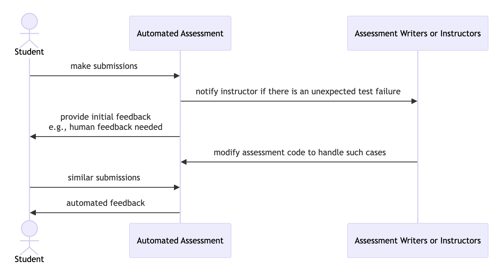

# Non-Automated Feedback

One essential difference between socassess and other automated feedback tools is
that socassess puts a lot of consideration into the scenario when accurate
automated feedback cannot be provided.

The ideal workflow looks like:

Currently, when automated feedback cannot be provided, socassess allows users to
_send an email to the instructor_, _ask ChatGPT to provide feedback_ with a
customizable prompt, or _combine the both_.
