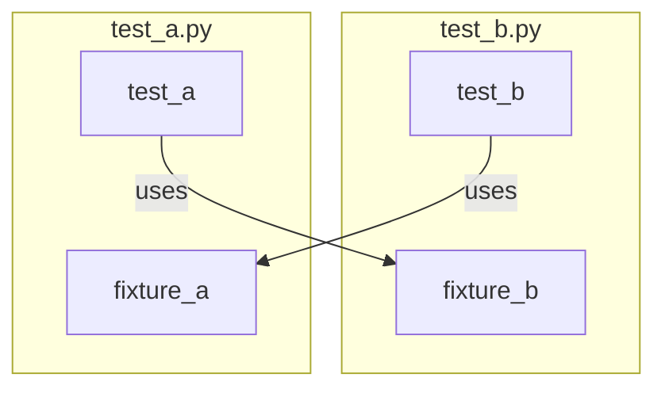
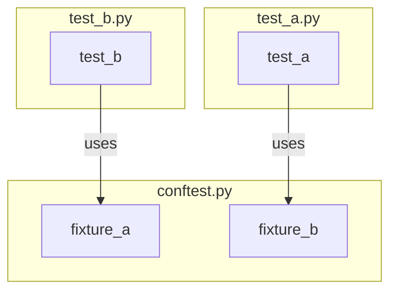

# Unit Testing Framework

A weird misunderstanding of automated assessments is that people think it is
trivial to create them. However, my experience tells me that it is in fact a
difficult task.

The first time when I created an automated assessment to grade students'
programs, I wrote almost everything from sratch, because I thought it might just
be few lines of code to compare the output from the student's program against
the expected output. However, soon I realized that what I needed to write was
not just the lines to compare the outputs. Additionally, I had to write bunch of
code to properly iterate students' programs, clean up any intermediate results
and side effect, and collect grades and feedback. All those things had
distracted me a lot.

Further, I also realized that the assessment code should be organized flexibly.
For instance, if an assignment contained two questions in a previous course
offering, and you created assessment code to assess both questions, but later
you decided to split the assignment into two smaller assignments with each
contains only one question. In that case, you want your assessment code can be
conveniently re-constructed.

I'll demonstrate how I managed to use the unit testing framework
[pytest](<https://docs.pytest.org/en/stable/contents.html>) to handle these
problems.

## pytest

I'm sure there are more things to discuss when the complexity of the assessment
code goes up, but here are several essential concepts about pytest that allowed
me to write my assessment code efficiently. In particular, they are _test
discovery_, _fixture_, _fixture scope_, _teardown/cleanup_, and _overriding
fixtures_.

### Test Discovery ([see its pytest document](<https://docs.pytest.org/en/stable/explanation/goodpractices.html#conventions-for-python-test-discovery>))

In our case, we just need to remember that pytest implements the standard Python
test discovery. That means it will search for `test_*.py` or `*_test.py` files,
and in those file, it will collect `test` prefixed functions or methods outside
of class, and `test` prefixed functions or methods inside `Test` prefixed
classes (without an `__init__` method).

For example, given the following folder structure and code in the files

```bash
tests
├── a.py
└── test_a.py
```

```python
# a.py
def test_a():
    assert True
```

```python
# test_a.py
def test_a():
    assert True


class A:
    def test_a(self):
        assert True


class TestA:
    def test_a(self):
        assert True
```

Then the results of `pytest -v tests` will be since `a.py` and class `A` are
skipped.

Notice that the methods are only referencing `self` in the signature as a
formality. No state is tied to the actual test class. This is a difference from
some other unit testing frameworks.

```bash
tests/test_a.py::test_a PASSED
tests/test_a.py::TestA::test_a PASSED
```

### Fixture ([see its pytest document](<https://docs.pytest.org/en/stable/explanation/fixtures.html#about-fixtures>))

> In testing, a fixture provides a defined, reliable and consistent context for
> the tests. This could include environment (for example a database configured
> with known parameters) or content (such as a dataset).

pytest knows a particular function to be a fixture function if it is decorated
with `@pytest.fixture`, and its returned object is a fixture. There can be more
than one fixture for a test. Fixtures can use (or depend on) other fixtures. If
an earlier fixture function has a problem and raises an exception, pytest will
stop executing fixture functions for that test. Meanwhile, it will mark the test
as having an error, indicating that the test could not be attempted.

A fixture often returns something which can be later used in test functions. In
the following example, the `my_obj` argument in the `test_obj` function is the
fixture returned by the `my_obj` fixture function.

```python
import pytest


@pytest.fixture
def my_obj():
    return "Assume this is an object"


def test_obj(my_obj):
    assert my_obj == "Assume this is an object"
```

pytest has lots of useful built-in fixtures (see
[its list](<https://docs.pytest.org/en/stable/reference/fixtures.html>)). Here are
some of them which I think are very useful.

- [`capsys`/`capfd`](<https://docs.pytest.org/en/stable/how-to/capture-stdout-stderr.html#accessing-captured-output-from-a-test-function>):
  it allows you to access captured output from a test function without caring
  about setting/resetting output streams.
- [`tmp_path`](<https://docs.pytest.org/en/stable/how-to/tmp_path.html#the-tmp-path-fixture>):
  it provides a temporary directory unique to each test function.
- [`request`](<https://docs.pytest.org/en/stable/reference/reference.html#std-fixture-request>):
  it provides information for the requesting test function, see an example
  [here](<https://docs.pytest.org/en/stable/example/simple.html#request-example>).

### Fixture Scope ([see its pytest document](<https://docs.pytest.org/en/stable/how-to/fixtures.html#fixture-scopes>))

By default, fixtures have the scope of `function`, which means fixtures are
destroyed (_i.e._, the cached objects are destroyed if any) at the end of the
test. However, we can make them with other scopes so that a fixture function is
invoked only once for multiple tests requiring it.

> Fixtures are created when first requested by a test, and are destroyed based
> on their scope:
>
> - `function`: the default scope, the fixture is destroyed at the end of the
>   test.
>
> - `class`: the fixture is destroyed during teardown of the last test in the
>   class.
>
> - `module`: the fixture is destroyed during teardown of the last test in the
>   module.
>
> - `package`: the fixture is destroyed during teardown of the last test in the
>   package where the fixture is defined, including sub-packages and
>   sub-directories within it.
>
> - `session`: the fixture is destroyed at the end of the test session.

I would also recommend going through the pytest documentation about [fixture
availability](<https://docs.pytest.org/en/stable/reference/fixtures.html#fixture-availability>).

### Teardown/Cleanup ([see its pytest document](<https://docs.pytest.org/en/stable/how-to/fixtures.html#teardown-cleanup-aka-fixture-finalization>))

If a test requires some necessary preparations by requiring one or more
fixtures, we would like to have necessary clean up so that those
preparations---which is only necessary for the particular test---do not mess
with any other tests.

pytest provides a very simple mechanism to achieve this, which is to use `yield`
instead of `return` inside fixture functions. Any code placed after `yield` is
considered teardown code. For example:

```python
@pytest.fixture
def my_fixture():
    my_obj = setup_code()
    yield my_obj
    teardown_code()
```

If `setup_code` throws an exception, pytest will not try to run the
`teardown_code`. Otherwise, pytest will always attempt to execute
`teardown_code`.

Insofar it is enough for us to understand how pytest does teardown, but it is
recommended to read about [safe
teardown](<https://docs.pytest.org/en/stable/how-to/fixtures.html#safe-teardowns>).

### Overriding Fixture ([see its pytest document](<https://docs.pytest.org/en/stable/how-to/fixtures.html#overriding-fixtures-on-various-levels>))

Fixture functions can be defined in the same `.py` file with its requiring
tests. However, it is likely to cause problems if we want to use fixtures
defined in different files. For example:



Therefore, pytest allows us to put fixture functions into a file called
`conftest.py` so that tests from multiple test modules in the directory can
access those fixture functions.



Please do not mix the concept of the fixture scope with this. In the following
example, the module scoped fixture function will return different fixtures for
`test_a` and `test_b`, but the session scoped fixture function will return the
same fixture.

```python
# conftest.py
import random

import pytest


@pytest.fixture(scope="module")
def module_val():
    """Generate a random number."""
    return random.randint(0, 9)


@pytest.fixture(scope="session")
def session_val():
    """Generate a random number."""
    return random.randint(0, 9)
```

```python
# test_a.py
def test_a(module_val, session_val):
    # intention fail so we can see the values
    assert 0, (module_val, session_val)
```

```python
# test_b.py
def test_b(module_val, session_val):
    # intention fail so we can see the values
    assert 0, (module_val, session_val)
```

A sample output looks like:

```bash
FAILED test_a.py::test_a - AssertionError: (2, 4)
FAILED test_b.py::test_b - AssertionError: (6, 4)
```

The simplest approach to override fixtures is probably by creating a different
`conftest.py` file. In the following example, we override the `expected_len`
fixture for special cases.

```python
tests/
    conftest.py
        # content of tests/conftest.py
        import pytest

        @pytest.fixture
        def expected_len():
            return 8

    test_username.py
        # content of tests/test_username.py
        def test_len(expected_len):
            username = 'username'  # ideally this is extracted from the student's file name
            assert len(username) == expected_len

    special_cases/
        conftest.py
            # content of tests/special_cases/conftest.py
            import pytest

            @pytest.fixture
            def expected_len():
                return 16  # override

        test_username_special.py
            # content of tests/special_cases/test_username_special.py
            def test_len(expected_len):
                username = 'special-username'  # ideally this is extracted from the student's file name
                assert len(username) == expected_len
```
