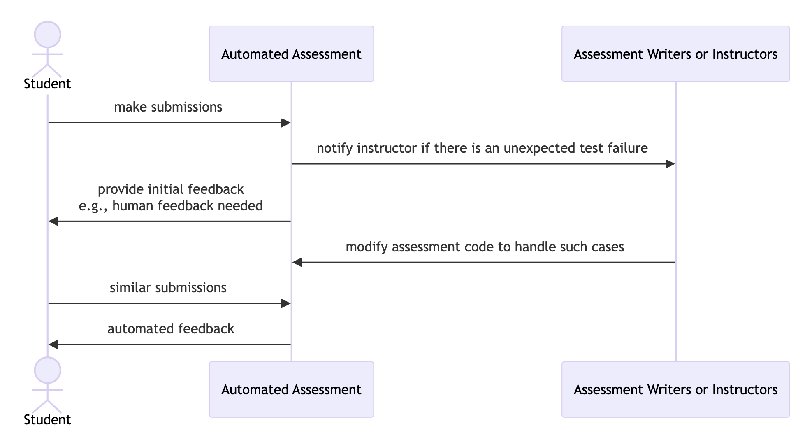

# Non-Automated Feedback

One essential difference between socassess and other automated feedback tools is
that socassess takes considerable care when accurate automated feedback cannot
be provided.

The ideal workflow is as follows:

Currently, when automated feedback cannot be provided, socassess allows users to
_ask ChatGPT to provide feedback_ using a customizable prompt and _send an email
to the instructor_.
